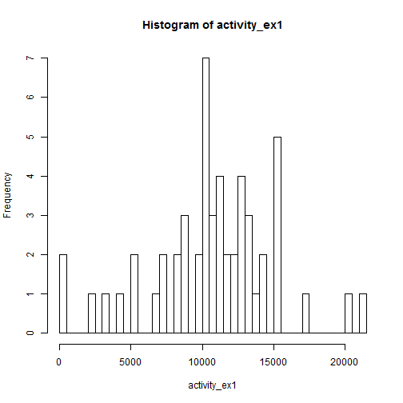
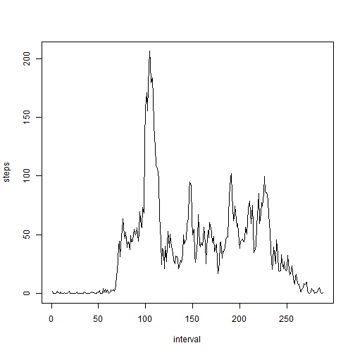
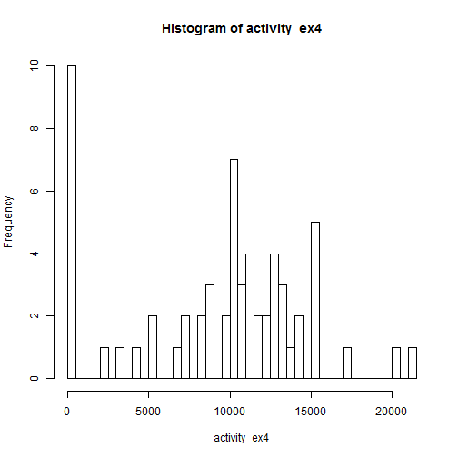
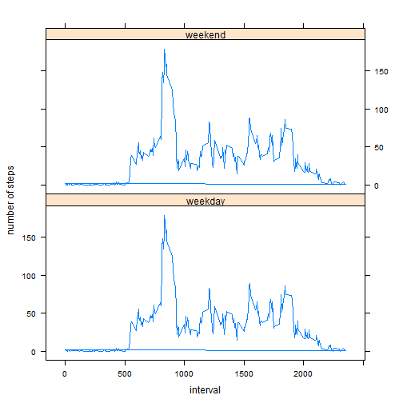

# Reproducible Res. Peer Ass. 1


First, load data into R 


```r
setwd("D:/Users/FRAENG/Documents/2 Projects/2014 Data Analysis/reproducibleresearch/peerassessment1")

activity <- read.csv("activity.csv", header = TRUE, sep = ",", stringsAsFactors = FALSE)
```


Process/transform the data (if necessary) into a format suitable for your analysis


```r
activity$date <- as.Date(activity$date)
```


What is mean total number of steps taken per day? (ignoring missing values)

1. Make a histogram of the total number of steps taken each day

```r
activity_ex1 <- na.omit(activity)
activity_ex1 <- tapply(activity_ex1$steps, activity_ex1$date, sum)
hist(activity_ex1, breaks = 53)  # 53 days 
```

 

```r
# Note: barplot(activity_ex1) # 53 days (would represent number of steps
# chronologically)
```


2. Calculate and report the mean and median total number of steps taken per day

```r
activity_ex1 <- na.omit(activity)
# personal note: smarter way to temporarily exclude NA: mean(…,na.rm=T)
activity_ex1_mean <- tapply(activity_ex1$steps, activity_ex1$date, mean)
# following will display mean number of steps per each day (not asked in
# question, but included) activity_ex1_mean following reports the mean
mean(activity_ex1_mean)  # Result: 37.3826
```

```
## [1] 37.38
```

```r

# http://stackoverflow.com/questions/8222245/convert-tapply-output-to-data-frame-in-r
# data.frame(key=names(activity_ex1_mean), value=activity_ex1_mean)

activity_ex1 <- na.omit(activity)
activity_ex1_median <- tapply(activity_ex1$steps, activity_ex1$date, median)
# following will display median number of steps per each day (not asked in
# question, but included) activity_ex1_median following reports the median
median(activity_ex1_median)  # Result: 0 
```

```
## [1] 0
```


What is the average daily activity pattern?

1. Make a time series plot (i.e. type = "l") of the 5-minute interval (x-axis) and the average number of steps taken, averaged across all days (y-axis)


```r
activity_ex2 <- na.omit(activity)
activity_ex2 <- tapply(activity_ex2$steps, activity_ex2$interval, mean)
plot(activity_ex2, type = "l", ylab = "steps", xlab = "interval")  # limits it intervals (250) 
```

 

```r
# personal Note: below barplot shows it by 2245 barplot(activity_ex2)
```


2. Which 5-minute interval, on average across all the days in the dataset, contains the maximum number of steps?


```r
activity_ex2 <- na.omit(activity)
activity_ex2 <- tapply(activity_ex2$steps, activity_ex2$interval, mean)
activity_ex2_max <- activity_ex2[which.max(activity_ex2)]
activity_ex2_max  #    835, 206.1698 
```

```
##   835 
## 206.2
```


Imputing missing values

Note that there are a number of days/intervals where there are missing values (coded as NA). The presence of missing days may introduce bias into some calculations or summaries of the data.

1. Calculate and report the total number of missing values in the dataset (i.e. the total number of rows with NAs)

```r
# 1st way
activity_ex3 <- na.omit(activity)
nrow(activity) - nrow(activity_ex3)  # 2304 
```

```
## [1] 2304
```

```r
# 2nd way nrow(activity[is.na(activity), ]) # 2304
```


2. Devise a strategy for filling in all of the missing values in the dataset. The strategy does not need to be sophisticated. For example, you could use the mean/median for that day, or the mean for that 5-minute interval, etc.

Since most of median values are 0, the devised strategy simply consists of replacing NAs with 0 


```r
activity <- read.csv("activity.csv", header = TRUE, sep = ",", stringsAsFactors = FALSE)
activity[is.na(activity)] <- 0

# Personal Note: Alternative approaches:
# activity$steps[activity$steps=='NA'] <- 0

# activity$steps_mean <- tapply(activity$steps, activity1$interval, mean)
# activity[activity=='NA'] <- activity$steps_mean

# activity$steps[is.na(activity$steps)] <- 0 activity$steps <-
# replace(activity$steps, activity$steps[is.na(activity$steps)], 0)

# Testing if replacement occurred properly: tail(activity$steps, 500)
```


3. Create a new dataset that is equal to the original dataset but with the missing data filled in.

```r
activity1 <- activity
```


4. Make a histogram of the total number of steps taken each day and Calculate and report the mean and median total number of steps taken per day. Do these values differ from the estimates from the first part of the assignment? What is the impact of imputing missing data on the estimates of the total daily number of steps?


```r
activity_ex4 <- tapply(activity1$steps, activity1$date, sum)
hist(activity_ex4, breaks = 53)
```

 


As far as the histogram is concerned, there is a small difference in structure, due than 
the impact of having a higher 0 bar due to replacing NAs with 0. 
The 0 bar now has a height of 10, due to which it changes the previous y-axis max scale
from 7 to 10. Other than that, structure remains consistent  


```r
activity_ex4_mean <- tapply(activity1$steps, activity1$date, mean)
# following will display mean number of steps per each day (not what
# question asked, but included) activity_ex4_mean
mean(activity_ex4_mean)  # Result: 32.47996
```

```
## [1] 32.48
```


As far as the mean is concerned, there is an impact of replacing missing data with 0. It went down from 37 to 32  


```r
activity_ex4_median <- tapply(activity1$steps, activity1$date, median)
# following will display median number of steps per each day (not what
# question asked, but included) activity_ex4_median
median(activity_ex4_median)
```

```
## [1] 0
```


As far as the median is concerned, there is virtually no impact of replacing missing data with 0. It stays constant at 0 


Are there differences in activity patterns between weekdays and weekends?

For this part the weekdays() function may be of some help here. Use the dataset with the filled-in missing values for this part.

1. Create a new factor variable in the dataset with two levels – “weekday” and “weekend” indicating whether a given date is a weekday or weekend day.

 

```r
# Alternative 1: For loop

activity1 <- activity
# convert to date
activity1$date <- as.Date(activity1$date)
# apply weekdays function to dates
activity1$date <- weekdays(activity1$date)


for (i in 1:length(activity1$date)) {
    if (activity1$date[i] == "Saturday" | activity1$date[i] == "Sunday") {
        activity1$date[i] <- "weekend"
    } else {
        activity1$date[i] <- "weekday"
    }
}

# test if replacement worked correctly: activity1$date[activity1$date ==
# 'weekend']

# convert date into factor
activity1$date <- factor(activity1$date)

# test if conversion worked properly levels(activity1$date)

# Alternative 2: vectorized (more efficient)
# activity1$date[weekdays(activity1$date) == 'Sunday' |
# weekdays(activity1$date) == 'Saturday'] <- 'weekend'
```


2. Make a panel plot containing a time series plot (i.e. type = "l") of the 5-minute interval (x-axis) and the average number of steps taken, averaged across all weekday days or weekend days (y-axis). The plot should look something like the following, which was creating using simulated data:


```r
library(lattice)

# below computes plot without having mean calculated xyplot(steps ~ interval
# | date, data = activity1, layout = c (1,2), type = 'l', ylab = 'number of
# # # steps', xlab = 'interval')

# below assigns result of tapply to new column. Each mean is assigned to
# correct interval
activity1$steps_mean <- tapply(activity1$steps, activity1$interval, mean)

# Final plot
xyplot(steps_mean ~ interval | date, data = activity1, layout = c(1, 2), type = "l", 
    ylab = "number of steps", xlab = "interval")
```

 


